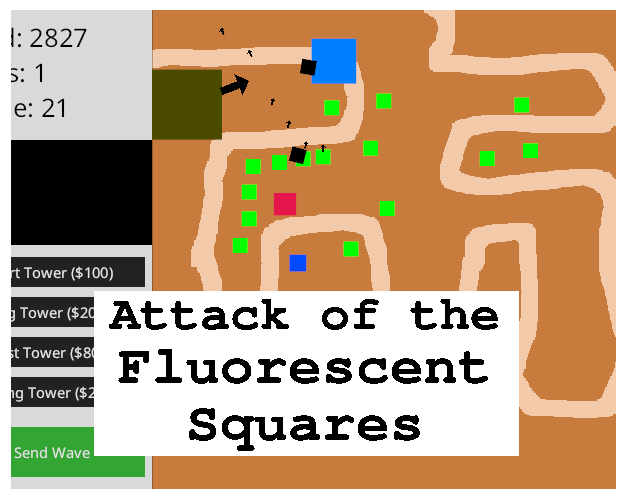

# Bevy Tower Defense

A small, incomplete tower defense demo hacked up for [Bevy Jam #1](https://itch.io/jam/bevy-jam-1). Play it online at [https://madadog.itch.io/unfair-advantage](https://madadog.itch.io/unfair-advantage).

## Features
* Play on 1 unique map
* Build up to 4 unique towers
* Encounter up to 4 unique enemy types
* Theoretically infinite stages
* There's a UI
* Some of the bullets are textured
* It's possible to lose

## Roadmap
Features I'd have liked to add if there was more time in the jam:
* Textures for enemies and towers
* Better texture for map
* Multiple stages
* Tower upgrades
* Sell towers
* Display tower ranges
* Make the UI look good
* Tower textures in UI
* Game balance
* Fast forward
* Toggleable auto-send waves
* Main Menu
* Restart after game over
* More tower/enemy types

## License

Licensed under either of [Apache License, Version
2.0](LICENSE-APACHE) or [MIT license](LICENSE-MIT) at your option.

Unless you explicitly state otherwise, any contribution intentionally submitted for inclusion in Bevy Tower Defense by you, as defined in the Apache-2.0 license, shall be
dual licensed as above, without any additional terms or conditions.
